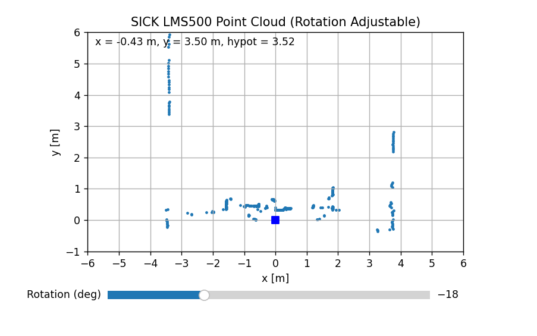

# SICK LMS500 Lidar Interpretation

Real-time point cloud visualiser for the SICK LMS500 LiDAR that works over Serial exposed on USB, rather than Ethernet.  

Reads LMDscandata telegrams over the serial service port, parses them, converts to Cartesian coordinates, and displays a live map with rotation control.

I reccomend comparing this against the point cloud output from the SICK SOPAS ET Engineering tool for Windows. Especially for rotation adjustment.

## Features
- Real-time point cloud using pyserial and matplotlib  
- Full LMDscandata parser  
- Rotation slider for alignment
- Cursor readout coordinates

## Requirements
Install dependencies:

pip install pyserial matplotlib numpy

Download and setup the USB driver from SICK. After that is done, check the Windows device manager for a lidar device on a COM port, should be ready to go then.

## Usage
1. Connect the LMS500 via USB and identify the COM port.  
2. Set `PORT = "COMx"` in the script.  
3. Run:

python main.py

4. Use the rotation slider to tune as reqiured.
5. Hover the cursor to view coordinates and range.

## NOTE

The LMS500 should be read via Ethernet for high-speed and high-resolution applications. This is a lightweight solution, especially useful for situations where Ethernet is not available.
